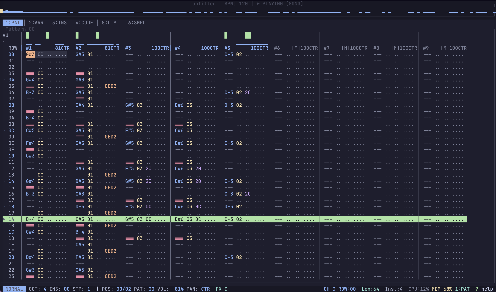

# Riffl



[](https://ko-fi.com/larpios)

> [!CAUTION] This project is still in development.

Riffl is an ambitious Rust-based music tracker designed for precision and performance.

## 🎯 Project Identity

- **Tracker Workflow:** Precise, hex-friendly, and highly ergonomic TUI interface.
- **Rust Powered:** Built for performance, safety, and low-latency audio.

## ⚡ Quick Start

### Prerequisites
- **Rust:** Install via [rustup.rs](https://rustup.rs/)
- **Audio Libraries:**
  - **macOS/Windows:** No additional dependencies.
  - **Linux (Debian/Ubuntu):** `sudo apt-get install libasound2-dev`
  - **Linux (Fedora):** `sudo dnf install alsa-lib-devel`

### Build & Run
```bash
cargo run -p riffl-tui
```

## ☕ Support the Project

If you find Riffl useful and would like to support its development, you can buy me a coffee!

[](https://ko-fi.com/larpios)

